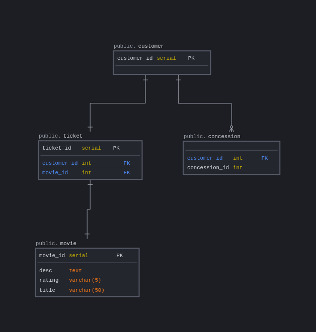

## Coding Temple Week 5 Day 2 Homework
###### CT-week5-day2-homework

Each customer holds their own ID
Each ticket holds it's ID to index the creation of tickets, the customer's ID, and the movie ID it's assigned to
Each movie holds it's ID, title, description, and rating
Each concession holds it's ID which can relate to a food item and the customer it's connected to

#### Diagram
